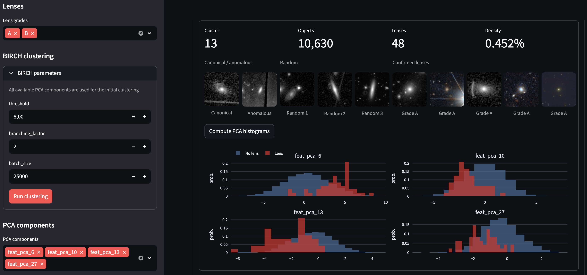
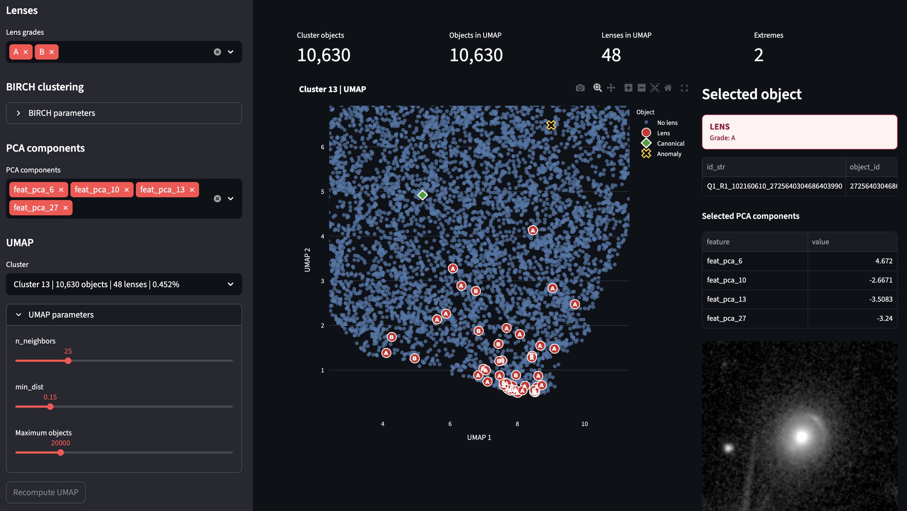

# Euclid UMAP Explorer

Euclid UMAP Explorer is a Streamlit web application for exploratory analysis of Euclid astronomical objects, morphology-based PCA representations, and labelled strong-lensing candidates.

The application is designed to help identify regions of morphology/PCA space that are enriched in strong-lens candidates, inspect those regions visually, and prioritize unlabelled objects that may be scientifically interesting for follow-up.

It does not classify objects as confirmed gravitational lenses. Instead, it provides an interactive analysis layer for clustering, dimensionality reduction, visual inspection, PCA thresholding, and candidate prioritization.

## Data Sources

The analysis uses Euclid Q1 catalogue products published on Zenodo:

- [Euclid Quick Data Release (Q1): First visual morphology catalogue](https://zenodo.org/records/15106473)
- [Euclid Quick Data Release (Q1): The Strong Lensing Discovery Engine](https://zenodo.org/records/15025832)

The app combines:

- Euclid visual morphology catalogue data.
- PCA representations, currently `feat_pca_0` through `feat_pca_39`.
- A strong-lensing candidate catalogue.
- Morphology cutouts.
- Lens-candidate images, when available.

Objects are joined through `object_id`. Objects present in the strong-lensing catalogue are treated as labelled lens candidates; all other objects are treated as `Unknown`, not as confirmed non-lenses.

Runtime data is expected to be available through configurable paths:

- PCA representations: `PARQUET_PATH`
- Straight-line-artifact-filtered PCA representations: `STRAIGHT_LINE_FILTERED_PARQUET_PATH`
- Lens-candidate catalogue: `LENS_PATH`
- Morphology cutouts: `CUTOUT_BASE`
- Lens-candidate images: `LENS_IMG_BASE`
- Optional morphology catalogue: `MORPH_PATH`

The `data/` directories in this repository are placeholders for local development workflows.

## Lens Candidate Grades

The application supports strong-lens candidate grades `A`, `B`, and `C`.

- **Grade A**: secure or almost secure lens candidates with clear lensing features such as arcs, multiple images, or Einstein-ring-like structures.
- **Grade B**: probable lens candidates with visually compatible features that require additional confirmation.
- **Grade C**: possible lens candidates with lens-like morphology that may also be explained by other physical structures, such as spiral arms, galaxy interactions, or complex morphology.

The user can select which grades are included in the analysis. By default, grades `A`, `B`, and `C` are selected.

## Analysis Flow

The intended workflow is:

1. Run BIRCH clustering over all available PCA components.
2. Compute lens-candidate density per cluster.
3. Inspect the clustering summary and visual examples.
4. Select clusters with high lens-candidate density.
5. Select and filter PCA components.
6. Visualize the selected cluster with UMAP.
7. Apply hierarchical subclustering inside promising clusters.
8. Use `A/B/C` labels to guide semi-supervised UMAP within subclusters.
9. Prioritize `Unknown` objects near lens-rich labelled regions.

This workflow supports scientific triage: it narrows large Euclid catalogues to smaller, enriched regions where follow-up inspection is more efficient.

## Features

- Loads PCA catalogues such as `representations_pca_40.parquet`.
- Optionally runs BIRCH on a PCA catalogue from which high-confidence straight-line image artifacts were removed.
- Automatically detects `feat_pca_*` columns.
- Derives `object_id` from `id_str` when required.
- Loads and joins a lens-candidate catalogue through `object_id`.
- Lets the user select lens grades included in the analysis.
- Runs BIRCH clustering using all available PCA components.
- Computes cluster-level lens-candidate density.
- Selects by default a cluster enriched in lens candidates.
- Provides visual cluster summaries with:
  - canonical object;
  - anomalous object;
  - random cluster examples;
  - labelled lens candidates.
- Computes PCA histograms comparing `Lens candidate` vs `Unknown`.
- Estimates PCA threshold recommendations that enrich lens candidates in a cluster.
- Applies recommended PCA filters interactively.
- Computes UMAP embeddings for selected clusters.
- Computes hierarchical subclusters inside the selected cluster.
- Computes semi-supervised UMAP for selected subclusters using labels `A=2`, `B=1`, `C=0`, and unknown objects as `-1`.
- Supports object search by `object_id`.
- Shows object metadata, selected PCA values, morphology-catalogue features, and available cutouts.
- Links selected/search objects to Aladin for external sky inspection.
- Includes an offline notebook for experimental arc-like-structure detection.
- Supports CSV export of clustering summaries and selected UMAP objects.

## Screenshots

### Clustering Summary



### UMAP Explorer



## Visual Analytics

The app provides several complementary visualizations:

- Cluster summary table with object counts, lens-candidate counts, and lens-candidate density.
- Visual cluster rows with canonical, anomalous, random, and labelled lens-candidate examples.
- PCA histograms comparing labelled lens candidates against unknown objects.
- Recommended PCA thresholds shown as vertical dashed lines on the histograms.
- Interactive Plotly UMAP of the selected cluster.
- UMAP overlays for lens candidates, canonical objects, anomalous objects, and hierarchical subclusters.
- Semi-supervised UMAP for subclusters guided by `A/B/C` candidate labels.
- Dendrogram preview to guide the number of hierarchical subclusters.
- Cutout inspection for selected or searched objects.
- Offline evaluation workflow for curve-aware arc-like-structure detection.

## PCA Threshold Recommendations

For each displayed PCA component, the app evaluates candidate thresholds of the form:

```text
feat_pca_X >= threshold
feat_pca_X <= threshold
```

For each threshold, it reports:

- retained objects;
- retained lens candidates;
- `lens_rate_%`;
- `enrichment_x`;
- `recall_%`.

`lens_rate_%` is the fraction of retained objects that are labelled lens candidates.

`enrichment_x` measures how much the lens-candidate density improves after applying the filter compared with the full cluster. For example, if a cluster has `0.5%` lens candidates and a PCA filter returns a subset with `5.0%` lens candidates, the enrichment is `10x`.

`recall_%` measures what fraction of the cluster's labelled lens candidates are retained by the filter.

These thresholds are exploratory prioritization tools. They should not be interpreted as definitive classification rules.

## Experimental Arc-Like Structure Detection

Arc-like structure detection is being evaluated offline with representative Euclid cutouts. The controls are currently hidden in the application while a curve-aware algorithm is calibrated and validated. The [experimental Colab notebook](notebooks/euclid_arc_like_structure_detection_v2_colab.ipynb) combines multiscale background subtraction with polar geometry, tangential alignment, angular-span measurements, and straight-feature rejection.

This experimental output is a visual prioritization aid, not a lens classifier. Spiral arms, edge-on galaxies, diffraction artifacts, interacting systems, and noise can still produce false positives.

## Scientific Use

Strong gravitational lenses are rare. Searching for them in large imaging surveys requires efficient prioritization strategies. Euclid UMAP Explorer helps by combining morphology-space clustering, labelled-candidate density, PCA filtering, and visual inspection.

The app can help answer questions such as:

- Do known lens candidates cluster in specific regions of Euclid morphology/PCA space?
- Which clusters are enriched in `A`, `B`, or `C` lens candidates?
- Which PCA components separate labelled candidates from unknown objects?
- Which unknown objects are close to known candidates in UMAP space?
- Do enriched clusters contain smaller substructures with even higher candidate density?
- Are `Grade C` candidates distributed as ambiguous bridge populations between confident candidates and the wider galaxy population?
- Which unlabelled objects should be prioritized for visual inspection or follow-up modelling?

## Guiding Unsupervised Lens Discovery

The outputs of the app can be used to guide unsupervised or weakly supervised gravitational-lens discovery workflows.

A practical strategy is:

1. Run BIRCH clustering over the full PCA catalogue.
2. Rank clusters by lens-candidate density.
3. Inspect enriched clusters visually.
4. Compute PCA histograms and threshold recommendations.
5. Apply PCA filters to isolate enriched regions.
6. Compute UMAP for the filtered cluster.
7. Run hierarchical subclustering to identify compact subregions.
8. Use semi-supervised UMAP to assess how labelled candidates shape the local projection.
9. Export unknown objects close to lens-rich regions.
10. Review those objects visually and in Aladin.
11. Feed prioritized candidates into visual inspection, active learning, anomaly detection, or downstream lens-modelling workflows.

This makes the app useful as a bridge between labelled strong-lens catalogues and unsupervised discovery. Labelled candidates act as anchors, while the unknown population is searched for objects that occupy similar morphology-space regions.

## Configuration

Set the required catalogue and image paths through environment variables:

```bash
export PARQUET_PATH="gs://<bucket>/catalogues/morphology_catalogue/representations_pca_40.parquet"
export STRAIGHT_LINE_FILTERED_PARQUET_PATH="gs://<bucket>/catalogues/morphology_catalogue/representations_pca_40_artifacts_filtered_v3_1_optimized_multiscale_hough_lines.parquet"
export LENS_PATH="gs://<bucket>/catalogues/strong_lensing_catalogue/q1_discovery_engine_lens_catalog.csv"
export CUTOUT_BASE="gs://<bucket>/catalogues/morphology_catalogue/cutouts_jpg_gz_arcsinh_vis_only"
export LENS_IMG_BASE="gs://<bucket>/catalogues/strong_lensing_catalogue/lens"
export EUCLID_USE_LOCAL_CACHE=0
```

Optional variables:

```bash
export MORPH_PATH="gs://<bucket>/catalogues/morphology_catalogue/morphology_catalogue.parquet"
export EUCLID_CACHE_DIR="$HOME/.cache/euclid-umap-explorer"
```

`MORPH_PATH` is used to display the full morphology-catalogue row for selected or searched objects when available.

`EUCLID_USE_LOCAL_CACHE=0` disables copying catalogue files into the local cache.

## Local Setup

Python 3.11 is required.

```bash
python3.11 -m venv .venv
source .venv/bin/activate
pip install --upgrade pip
pip install -r requirements.txt
```

Configure the environment variables and start Streamlit:

```bash
streamlit run app.py
```

## Cloud Run Deployment

Example deployment command:

```bash
gcloud run deploy euclid-umap-app \
  --source . \
  --region europe-west1 \
  --allow-unauthenticated \
  --memory 4Gi \
  --cpu 2 \
  --timeout 900 \
  --set-env-vars=PARQUET_PATH=gs://<bucket>/catalogues/morphology_catalogue/representations_pca_40.parquet,LENS_PATH=gs://<bucket>/catalogues/strong_lensing_catalogue/q1_discovery_engine_lens_catalog.csv,CUTOUT_BASE=gs://<bucket>/catalogues/morphology_catalogue/cutouts_jpg_gz_arcsinh_vis_only,LENS_IMG_BASE=gs://<bucket>/catalogues/strong_lensing_catalogue/lens,EUCLID_USE_LOCAL_CACHE=0
```

The `Dockerfile` runs Streamlit on the Cloud Run `$PORT`.

## Repository Layout

```text
.
├── app.py
├── requirements.txt
├── Dockerfile
├── README.md
├── assets/
├── docs/
├── euclid_umap_explorer/
└── data/
    ├── morphology/
    ├── strong_lenses/
    └── cutouts/
```
